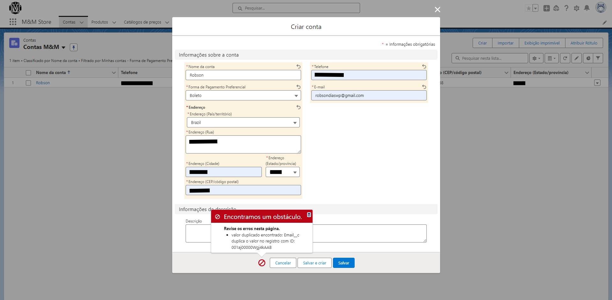
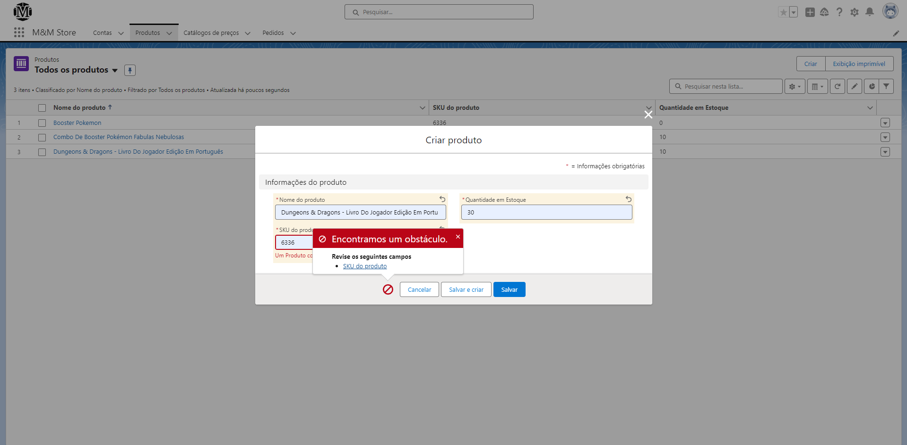
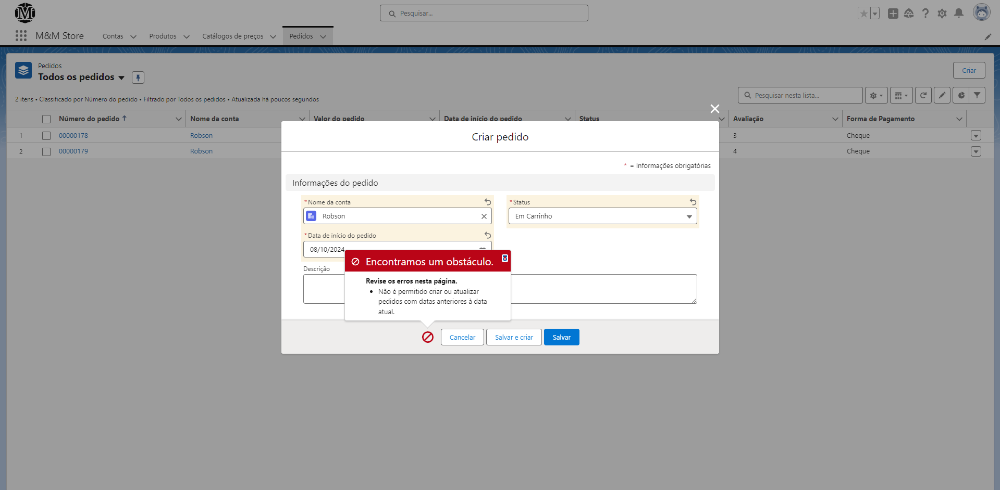
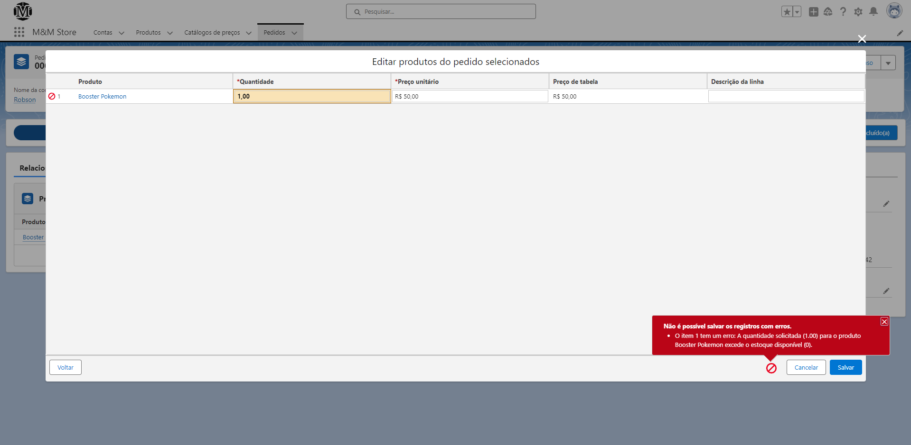
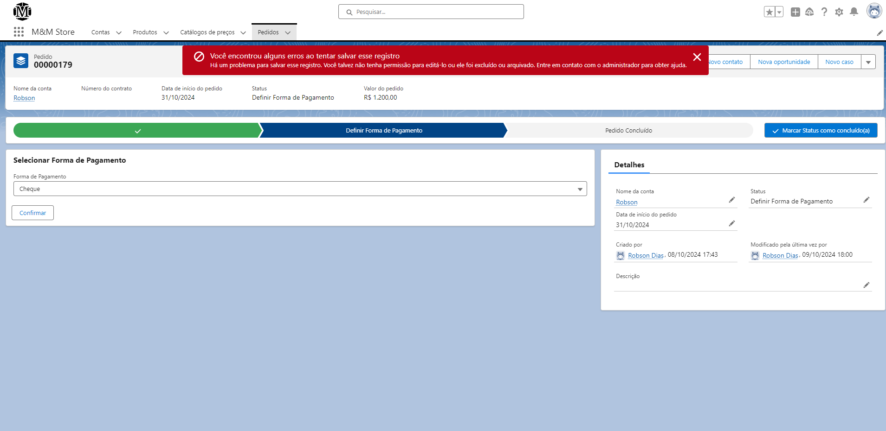
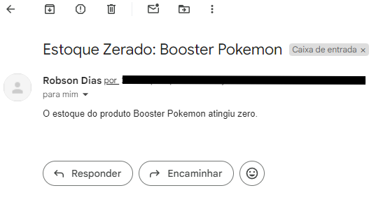
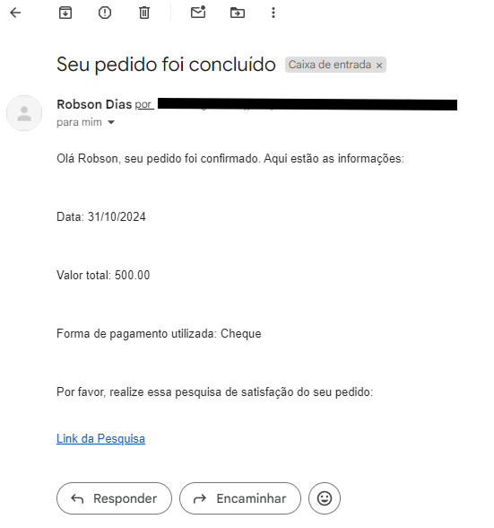
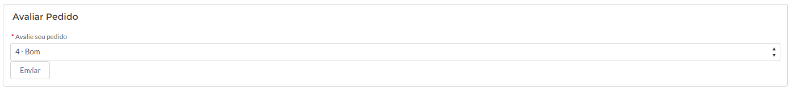

# E-commerce Salesforce

Este projeto é uma implementação de uma plataforma de e-commerce utilizando Salesforce, com o objetivo de explorar as funcionalidades da plataforma, como triggers, Apex, SOQL, Communities, e outros recursos relevantes para o desenvolvimento de um sistema de vendas online.

## Índice
1. [Requisitos](#requisitos)
2. [Estrutura do Projeto](#estrutura-do-projeto)
3. [Fotos do Projeto](#fotos-do-projeto)

## Requisitos

### **Cadastro de Produtos:**
- Nome
- SKU (Código de Identificação)
- Preço
- Quantidade em Estoque

### **Cadastro de Clientes**
- Nome
- Endereço
- Telefone
- E-mail
- Forma de Pagamento Preferencial (Cartão, Pix, Boleto, Cheque)

### **Criação de Pedido**
- Data do Pedido
- Produtos
- Valor Total
- Status do Pedido: Em Carrinho / Definir Forma de Pagamento / Pedido Concluído

### **Regras de Negócio**
- **Gestão de Produtos**: Controle de estoque e listagem de produtos.
- **Gestão de Pedidos**: Criação, atualização e cancelamento de pedidos.
- **Automação de Processos**: Implementação de triggers para automatizar fluxos de negócios, como controle de estoque e validação de pedidos.
- **Avaliação de Compras**: Envio de pesquisas de satisfação após a conclusão de pedidos, permitindo que os clientes avaliem suas compras.
- **Pagamento**: Processos de definir e validar formas de pagamento em diferentes etapas do pedido.
- **Communities**: Utilização do Salesforce Communities para permitir que os clientes acompanhem seus pedidos e façam avaliações.
- **Integração de Email**: Envio de e-mails automáticos para confirmação de compra, lembretes e atualizações de status do pedido.

## Estrutura do Projeto

- **Apex Classes**
  - `OrderController`: Controla as ações relacionadas aos pedidos, como criação e fechamento de pedidos.
  - `PagamentoPadraoHelper`: Gerencia as formas de pagamento preferenciais.
  - `ControleQuantidadeHelper`: Valida a quantidade disponível em estoque.
  - `AvaliarPedidoController`: Lida com a lógica de avaliação de pedidos.
  
- **Triggers**
  - `ControleQuantidade`: Valida o estoque no momento da compra.
  - `ValidaData`: Garante que os pedidos não sejam criados com datas anteriores à data atual.
  
- **Componentes Aura**
  - Formulários para atualização de status de pedidos, envio de avaliações e visualização de detalhes do pedido.
  
- **SOQL Queries**
  - Consultas de dados para verificar o estoque, buscar informações de produtos e gerenciar pedidos em tempo real.
- **Validações em Salesforce**
  - Algumas das validações foram feitas nos próprios objetos, como o e-mail e SKU únicos, o da data de pedido foi feita através das regras de validação.

## Fotos do Projeto

**Validação da Conta**
- Validação realizada no campo E-mail do cadastro, ele deve ser único.

---

**Validação do Produto**
- Validação realizada no SKU do Produto, ele deve ser único.

---

**Validação de Data**
- Validação realizada na data do pedido, ela não pode ser anterior ao dia atual.

---

**Validação de Pedido**
- Aqui é feita uma verificação no estoque onde se o pedido tiver mais itens do que o númerom disponível de produtos é retornado um erro de feedback para o usuário

---

**Validação de Pedido Paralelo**
- Uma verificação também é feita durante a confirmação do pedido para caso haja uma transação em paralelo, caso um pedido seja fechado e a dedução faça o número de pedidos ficar inferior ao de algum pedido em paralelo um erro também será retornado
- O campo de "Forma de Pagamento" vem por padrão preenchido com o escolhido pelo cliente como preferencial no momento do cadastro
- A dedução do pedido só acontece quando o pedido passa para o último status, o "Pedido Concluído"

---

**E-mail de Estoque**
- Quando o estoque de algum produto é zerado, um E-mail é enviado para o administrador do sistema onde é informado qual produto foi zerado

---

**E-mail de Pedido**
- Quando o pedido é concluído, um E-mail é enviado para o Cliente associado ao pedido a partir do endereço E-mail preenchido no cadastro da Conta 

---

**Avaliação do Pedido**
- Esta é a área de avaliação do pedido, quando ela é feita há um alert de feedback para o usuário e o valor dado por ele é colocado no campo "Avaliação" presente no pedido

